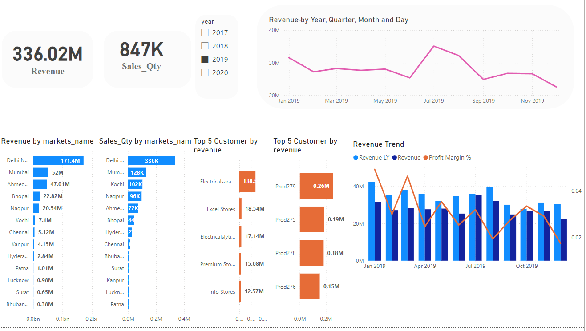
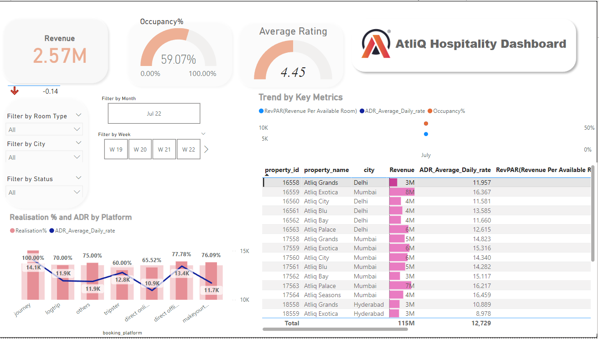

# Power BI Project: Sales and Hospitality Dashboards

This repository contains two Power BI projects that provide comprehensive insights into sales performance and the hospitality industry. The dashboards include interactive visualizations and detailed analysis of key metrics.

## Sales Performance Dashboard

The Sales Performance Dashboard offers insights into key sales metrics, such as total sales, revenue trends, top-performing products, and regional sales distribution. It allows users to interact with the data through filters and drill-down capabilities.

### Key Features:
- Total revenue and sales quantity
- Revenue by market and sales quantity by market
- Top 5 customers by revenue
- Revenue trends over time

## Hospitality Dashboard

The Hospitality Dashboard provides insights specific to the hospitality domain, including metrics such as occupancy rates, average rating, revenue per available room (RevPAR), and average daily rate (ADR). The dashboard supports filtering by various dimensions like room type, city, and status.

### Key Features:
- Total revenue and occupancy percentage
- Average rating of properties
- Revenue trends by key metrics (RevPAR, ADR, Occupancy%)
- Filters for room type, city, and status
- Realization percentage and ADR by booking platform

## Technologies Used
- Power BI
- DAX (Data Analysis Expressions)
- Data modeling and transformation

## Usage
Clone the repository and open the Power BI files to explore the dashboards with sample data provided. These dashboards demonstrate the ability to transform raw data into actionable business intelligence.

